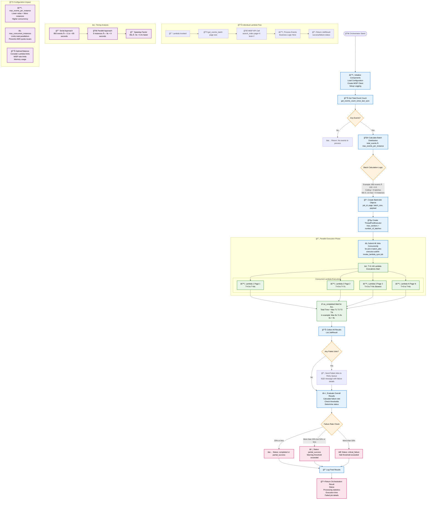

# Execution flow and Timing analysis

```mermaid
flowchart TD
    START([🚀 Orchestrator Starts]) --> INIT[âš™ï¸ Initialize Components<br/>Load Configuration<br/>Create MISP Client<br/>Setup Logging]
    
    INIT --> COUNT[📊 Get Total Event Count<br/>get_events_count_since_last_sync]
    
    COUNT --> CHECK{Any Events?}
    CHECK -->|No| EARLY_EXIT[✅ Return: No events to process]
    CHECK -->|Yes| CALC[🧮 Calculate Batch Distribution<br/>total_events ÷ max_events_per_instance]
    
    CALC --> BATCH_LOGIC{Batch Calculation Logic}
    BATCH_LOGIC -->|Example: 850 events ÷ 100 = 8.5<br/>Ceiling = 9 batches<br/>Min 9, 10 max = 9 instances| CREATE_JOBS[📋 Create BatchJob Objects<br/>job_id, page, batch_size, payload]
    
    CREATE_JOBS --> THREAD_POOL[🧵 Create ThreadPoolExecutor<br/>max_workers = number_of_batches]
    
    THREAD_POOL --> SUBMIT_ALL[âš¡ Submit All Jobs Concurrently<br/>for job in batch_jobs<br/>executor.submit invoke_lambda_sync job]
    
    subgraph "🔄 Parallel Execution Phase"
        SUBMIT_ALL --> PARALLEL_START[â±ï¸ T=0: All Lambda Invocations Start]
        
        subgraph "Concurrent Lambda Executions"
            LAMBDA1[âš™ï¸ Lambda 1 Page 1<br/>T=0 to T=8s]
            LAMBDA2[âš™ï¸ Lambda 2 Page 2<br/>T=0 to T=7s] 
            LAMBDA3[âš™ï¸ Lambda 3 Page 3<br/>T=0 to T=9s Slowest]
            LAMBDAN[âš™ï¸ Lambda N Page N<br/>T=0 to T=6s]
        end
        
        PARALLEL_START --> LAMBDA1
        PARALLEL_START --> LAMBDA2
        PARALLEL_START --> LAMBDA3
        PARALLEL_START --> LAMBDAN
    end
    
    subgraph "📊 Individual Lambda Flow"
        LAMBDA_START[🯠Lambda Invoked] --> FETCH_BATCH[📥 get_events_batch page size]
        FETCH_BATCH --> MISP_CALL[🌠MISP API Call<br/>search_index page=X limit=Y]
        MISP_CALL --> PROCESS_EVENTS[âš™ï¸ Process Events<br/>Business Logic Here]
        PROCESS_EVENTS --> LAMBDA_RESULT[📋 Return JobResult<br/>success/failure status]
    end
    
    LAMBDA1 --> WAIT_ALL
    LAMBDA2 --> WAIT_ALL
    LAMBDA3 --> WAIT_ALL
    LAMBDAN --> WAIT_ALL
    
    WAIT_ALL[â³ as_completed Wait for ALL<br/>Total Time = Max T1 T2 T3 TN<br/>In example: Max 8s 7s 9s 6s = 9s]
    
    WAIT_ALL --> COLLECT[📊 Collect All Results<br/>List JobResult]
    
    COLLECT --> HANDLE_FAILURES{Any Failed Jobs?}
    HANDLE_FAILURES -->|Yes| SEND_TO_RETRY[🔄 Send Failed Jobs to Retry Queue<br/>SQS message with failure details]
    HANDLE_FAILURES -->|No| EVALUATE
    SEND_TO_RETRY --> EVALUATE
    
    EVALUATE[âš–ï¸ Evaluate Overall Results<br/>Calculate failure rate<br/>Check thresholds<br/>Determine status]
    
    EVALUATE --> THRESHOLD{Failure Rate Check}
    THRESHOLD -->|20% or less| SUCCESS_STATUS[✅ Status: completed or partial_success]
    THRESHOLD -->|More than 20% but 50% or less| WARNING_STATUS[âš ï¸ Status: partial_success<br/>Warning threshold exceeded]
    THRESHOLD -->|More than 50%| CRITICAL_STATUS[⌠Status: critical_failure<br/>Halt threshold exceeded]
    
    SUCCESS_STATUS --> FINAL_LOG[📠Log Final Results]
    WARNING_STATUS --> FINAL_LOG
    CRITICAL_STATUS --> FINAL_LOG
    
    FINAL_LOG --> RETURN_RESULT[📤 Return Orchestration Result<br/>Status<br/>Processing statistics<br/>Execution time<br/>Failed job details]
    
    subgraph "â±ï¸ Timing Analysis"
        TIMING1[📈 Serial Approach<br/>850 events × 0.1s = 85 seconds]
        TIMING2[🚀 Parallel Approach<br/>9 instances × 9s = 9 seconds]
        TIMING3[🯠Speedup Factor<br/>85s ÷ 9s = 9.4x faster]
        
        TIMING1 --> TIMING2 --> TIMING3
    end
    
    subgraph "🔧 Configuration Impact"
        CONFIG1[âš™ï¸ max_events_per_instance<br/>Lower value = More instances<br/>Higher concurrency]
        CONFIG2[âš¡ max_concurrent_instances<br/>Limits total parallelism<br/>Prevents AWS quota issues]
        CONFIG3[📊 Optimal Balance<br/>Consider Lambda limits<br/>MISP rate limits<br/>Memory usage]
    end
    
    %% Styling
    classDef processStep fill:#e3f2fd,stroke:#1976d2,stroke-width:2px,color:#000
    classDef decisionStep fill:#fff3e0,stroke:#f57c00,stroke-width:2px,color:#000
    classDef parallelStep fill:#e8f5e8,stroke:#388e3c,stroke-width:2px,color:#000
    classDef resultStep fill:#fce4ec,stroke:#c2185b,stroke-width:2px,color:#000
    classDef timingStep fill:#f3e5f5,stroke:#7b1fa2,stroke-width:2px,color:#000
    
    class INIT,COUNT,CALC,CREATE_JOBS,THREAD_POOL,SUBMIT_ALL,COLLECT,EVALUATE,FINAL_LOG processStep
    class CHECK,BATCH_LOGIC,HANDLE_FAILURES,THRESHOLD decisionStep
    class PARALLEL_START,LAMBDA1,LAMBDA2,LAMBDA3,LAMBDAN,WAIT_ALL parallelStep
    class SUCCESS_STATUS,WARNING_STATUS,CRITICAL_STATUS,RETURN_RESULT resultStep
    class TIMING1,TIMING2,TIMING3,CONFIG1,CONFIG2,CONFIG3 timingStep
```