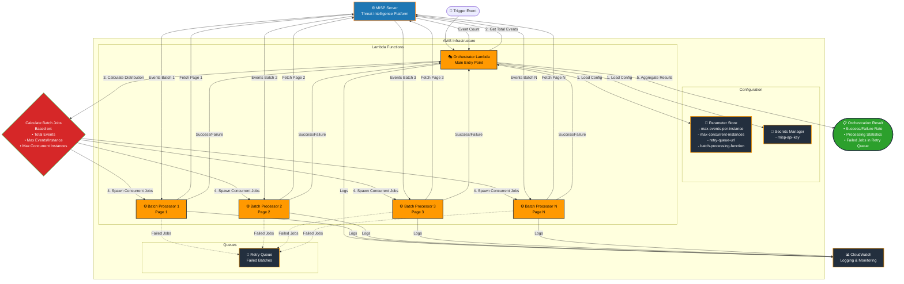

# MISP Ingestion system
## Architecture and flow

```mermaid
graph TB
    %% External Systems
    MISP[🌐 MISP Server<br/>Threat Intelligence Platform]
    CW[📊 CloudWatch<br/>Logging & Monitoring]
    
    %% AWS Infrastructure
    subgraph "AWS Infrastructure"
        subgraph "Configuration"
            PS[🔧 Parameter Store<br/>- max-events-per-instance<br/>- max-concurrent-instances<br/>- retry-queue-url<br/>- batch-processing-function]
            SM[🔐 Secrets Manager<br/>- misp-api-key]
        end
        
        subgraph "Lambda Functions"
            ORCH[🎭 Orchestrator Lambda<br/>Main Entry Point]
            BP1[⚙️ Batch Processor 1<br/>Page 1]
            BP2[⚙️ Batch Processor 2<br/>Page 2] 
            BP3[⚙️ Batch Processor 3<br/>Page 3]
            BPN[⚙️ Batch Processor N<br/>Page N]
        end
        
        subgraph "Queues"
            RQ[🔄 Retry Queue<br/>Failed Batches]
        end
    end
    
    %% Flow starts
    START([🚀 Trigger Event]) --> ORCH
    
    %% Orchestrator Flow
    ORCH --> |1. Load Config| PS
    ORCH --> |1. Load Config| SM
    ORCH --> |2. Get Total Events| MISP
    MISP --> |Event Count| ORCH
    
    %% Decision and Distribution
    ORCH --> |3. Calculate Distribution| CALC{Calculate Batch Jobs<br/>Based on:<br/>• Total Events<br/>• Max Events/Instance<br/>• Max Concurrent Instances}
    
    %% Parallel Execution
    CALC --> |4. Spawn Concurrent Jobs| BP1
    CALC --> |4. Spawn Concurrent Jobs| BP2  
    CALC --> |4. Spawn Concurrent Jobs| BP3
    CALC --> |4. Spawn Concurrent Jobs| BPN
    
    %% Each batch processor fetches its page
    BP1 --> |Fetch Page 1| MISP
    BP2 --> |Fetch Page 2| MISP
    BP3 --> |Fetch Page 3| MISP
    BPN --> |Fetch Page N| MISP
    
    %% Processing and Results
    MISP --> |Events Batch 1| BP1
    MISP --> |Events Batch 2| BP2
    MISP --> |Events Batch 3| BP3
    MISP --> |Events Batch N| BPN
    
    %% Success/Failure Handling
    BP1 --> |Success/Failure| ORCH
    BP2 --> |Success/Failure| ORCH
    BP3 --> |Success/Failure| ORCH
    BPN --> |Success/Failure| ORCH
    
    %% Failed job handling
    BP1 -.-> |Failed Jobs| RQ
    BP2 -.-> |Failed Jobs| RQ
    BP3 -.-> |Failed Jobs| RQ
    BPN -.-> |Failed Jobs| RQ
    
    %% Logging
    ORCH --> |Logs| CW
    BP1 --> |Logs| CW
    BP2 --> |Logs| CW
    BP3 --> |Logs| CW
    BPN --> |Logs| CW
    
    %% Final result
    ORCH --> |5. Aggregate Results| RESULT([📋 Orchestration Result<br/>• Success/Failure Rate<br/>• Processing Statistics<br/>• Failed Jobs in Retry Queue])
    
    %% Styling
    classDef lambdaStyle fill:#FF9900,stroke:#232F3E,stroke-width:2px,color:#000
    classDef awsService fill:#232F3E,stroke:#FF9900,stroke-width:2px,color:#fff
    classDef external fill:#1f77b4,stroke:#ff7f0e,stroke-width:2px,color:#fff
    classDef decision fill:#d62728,stroke:#2ca02c,stroke-width:2px,color:#fff
    classDef result fill:#2ca02c,stroke:#232F3E,stroke-width:2px,color:#fff
    
    class ORCH,BP1,BP2,BP3,BPN lambdaStyle
    class PS,SM,RQ,CW awsService
    class MISP external
    class CALC decision
    class RESULT result
```