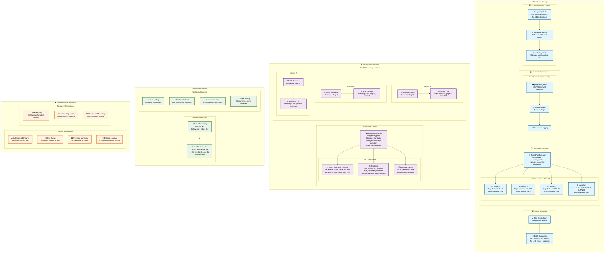

# How paralellism is achieved

```mermaid
graph TB
    subgraph "📊 Parallelism Strategy"
        subgraph "1️⃣ Event Distribution"
            TC[📈 Total Events Count<br/>Example: 850 events]
            CALC[🧮 Batch Calculation<br/>850 / 100 = 8.5 = 9 batches<br/>Min 9, 10 max = 9 instances]
            TC --> CALC
        end
        
        subgraph "2️⃣ Concurrent Execution"
            TPE[🧵 ThreadPoolExecutor<br/>max_workers = batch_count<br/>manages concurrent invocations]
            
            subgraph "Lambda Invocations (Parallel)"
                L1[⚙️ Lambda 1<br/>Page 1: Events 1-100<br/>invoke_lambda_sync]
                L2[⚙️ Lambda 2<br/>Page 2: Events 101-200<br/>invoke_lambda_sync]
                L3[⚙️ Lambda 3<br/>Page 3: Events 201-300<br/>invoke_lambda_sync]
                LN[⚙️ Lambda N<br/>Page N: Events N-1*100+1 to N*100<br/>invoke_lambda_sync]
            end
            
            TPE --> L1
            TPE --> L2
            TPE --> L3
            TPE --> LN
        end
        
        subgraph "3️⃣ Independent Processing"
            subgraph "Each Lambda Independently"
                FETCH[📥 get_events_batch<br/>MISP API call with pagination]
                PROC[⚙️ Process Events<br/>Business Logic]
                LOG[📝 CloudWatch Logging]
                
                FETCH --> PROC --> LOG
            end
        end
        
        subgraph "4️⃣ Synchronization & Results"
            WAIT[⏳ as_completed<br/>Wait for all jobs to finish<br/>No job blocks others]
            AGG[📊 Aggregate Results<br/>Collect all JobResult objects]
            EVAL[⚖️ evaluate_results<br/>Calculate success/failure rates]
            
            WAIT --> AGG --> EVAL
        end
    end
    
    subgraph "🏗️ Technical Architecture"
        subgraph "Orchestrator Lambda"
            OL[🎭 LambdaOrchestrator<br/>Single entry point<br/>Calculates distribution<br/>Manages concurrent execution<br/>Waits for completion]
            
            subgraph "Key Components"
                MTFP[🔧 MispThreatFeedProcessor<br/>get_events_count_since_last_sync<br/>get_events_batch page batch_size]
                
                CONFIG[⚙️ MispConfig<br/>max_events_per_instance<br/>max_concurrent_instances<br/>batch_processing_function_name]
                
                JOBS[📋 BatchJob Objects<br/>job_id, page, batch_size<br/>function_name, payload]
            end
            
            OL --> MTFP
            OL --> CONFIG
            OL --> JOBS
        end
        
        subgraph "Batch Processing Lambdas"
            subgraph "Instance 1"
                BP1[⚙️ Batch Processor<br/>Processes Page 1]
                MISP1[🌐 MISP API Call<br/>timestamp=24h, page=1, limit=100]
                BP1 --> MISP1
            end
            
            subgraph "Instance 2"
                BP2[⚙️ Batch Processor<br/>Processes Page 2]
                MISP2[🌐 MISP API Call<br/>timestamp=24h, page=2, limit=100]
                BP2 --> MISP2
            end
            
            subgraph "Instance N"
                BPN[⚙️ Batch Processor<br/>Processes Page N]
                MISPN[🌐 MISP API Call<br/>timestamp=24h, page=N, limit=100]
                BPN --> MISPN
            end
        end
    end
    
    subgraph "💡 Parallelism Benefits"
        subgraph "Performance Gains"
            SERIAL[📈 Serial Processing<br/>Time = N × T<br/>850 events × 0.1s = 85s]
            PARALLEL[🚀 Parallel Processing<br/>Time = Max T1, T2, TN<br/>= 100 events × 0.1s = 10s<br/>8.5x speedup]
            
            SERIAL -.->|vs| PARALLEL
        end
        
        subgraph "Scalability Features"
            SCALE1[📊 Auto-scaling<br/>Based on event count]
            SCALE2[⚡ Configurable limits<br/>max_concurrent_instances]
            SCALE3[🔄 Failure isolation<br/>One failed job = total failure]
            SCALE4[📈 Linear scaling<br/>More events = more instances]
        end
    end
    
    subgraph "🛡️ Error Handling & Resilience"
        subgraph "Failure Management"
            FH1[⚠️ Individual Job Failures<br/>Do not affect other jobs]
            FH2[🔄 Retry Queue<br/>Failed jobs queued for later]
            FH3[📊 Threshold Monitoring<br/>20% warning, 50% halt]
            FH4[📝 Detailed Logging<br/>Per-job tracking and metrics]
        end
        
        subgraph "Recovery Mechanisms"
            REC1[🔄 Deferred Retry<br/>SQS queue for failed batches]
            REC2[⚖️ Graceful Degradation<br/>Partial success handling]
            REC3[📊 CloudWatch Monitoring<br/>Success/failure metrics]
        end
    end
    
    %% Styling
    classDef parallelStrategy fill:#e1f5fe,stroke:#01579b,stroke-width:2px,color:#000
    classDef techArch fill:#f3e5f5,stroke:#4a148c,stroke-width:2px,color:#000
    classDef benefits fill:#e8f5e8,stroke:#1b5e20,stroke-width:2px,color:#000
    classDef errorHandling fill:#fff3e0,stroke:#e65100,stroke-width:2px,color:#000
    
    class TC,CALC,TPE,L1,L2,L3,LN,FETCH,PROC,LOG,WAIT,AGG,EVAL parallelStrategy
    class OL,MTFP,CONFIG,JOBS,BP1,BP2,BPN,MISP1,MISP2,MISPN techArch
    class SERIAL,PARALLEL,SCALE1,SCALE2,SCALE3,SCALE4 benefits
    class FH1,FH2,FH3,FH4,REC1,REC2,REC3 errorHandling
```