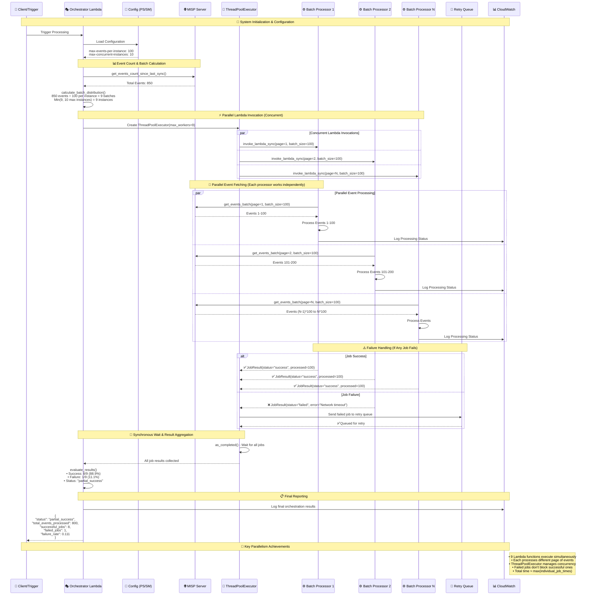

# Paralellism Sequence Diagram

```mermaid
sequenceDiagram
    participant Client as 🎯 Client/Trigger
    participant Orch as 🎭 Orchestrator Lambda
    participant Config as 🔧 Config (PS/SM)
    participant MISP as 🌐 MISP Server
    participant TE as 🧵 ThreadPoolExecutor
    participant BP1 as ⚙️ Batch Processor 1
    participant BP2 as ⚙️ Batch Processor 2
    participant BPN as ⚙️ Batch Processor N
    participant RQ as 🔄 Retry Queue
    participant CW as 📊 CloudWatch

    Note over Client,CW: 🚀 System Initialization & Configuration
    Client->>Orch: Trigger Processing
    Orch->>Config: Load Configuration
    Config-->>Orch: max-events-per-instance: 100<br/>max-concurrent-instances: 10
    
    Note over Orch,MISP: 📊 Event Count & Batch Calculation
    Orch->>MISP: get_events_count_since_last_sync()
    MISP-->>Orch: Total Events: 850
    
    Orch->>Orch: calculate_batch_distribution()<br/>850 events ÷ 100 per instance = 9 batches<br/>Min(9, 10 max instances) = 9 instances
    
    Note over Orch,BPN: ⚡ Parallel Lambda Invocation (Concurrent)
    Orch->>TE: Create ThreadPoolExecutor(max_workers=9)
    
    par Concurrent Lambda Invocations
        TE->>BP1: invoke_lambda_sync(page=1, batch_size=100)
    and
        TE->>BP2: invoke_lambda_sync(page=2, batch_size=100) 
    and
        TE->>BPN: invoke_lambda_sync(page=N, batch_size=100)
    end
    
    Note over BP1,MISP: 🔄 Parallel Event Fetching (Each processor works independently)
    par Parallel Event Processing
        BP1->>MISP: get_events_batch(page=1, batch_size=100)
        MISP-->>BP1: Events 1-100
        BP1->>BP1: Process Events 1-100
        BP1->>CW: Log Processing Status
    and
        BP2->>MISP: get_events_batch(page=2, batch_size=100)
        MISP-->>BP2: Events 101-200
        BP2->>BP2: Process Events 101-200
        BP2->>CW: Log Processing Status
    and
        BPN->>MISP: get_events_batch(page=N, batch_size=100)
        MISP-->>BPN: Events (N-1)*100 to N*100
        BPN->>BPN: Process Events
        BPN->>CW: Log Processing Status
    end
    
    Note over BP1,RQ: ⚠️ Failure Handling (If Any Job Fails)
    alt Job Success
        BP1-->>TE: ✅ JobResult(status="success", processed=100)
        BP2-->>TE: ✅ JobResult(status="success", processed=100)
        BPN-->>TE: ✅ JobResult(status="success", processed=100)
    else Job Failure  
        BP2-->>TE: ❌ JobResult(status="failed", error="Network timeout")
        TE->>RQ: Send failed job to retry queue
        RQ-->>TE: ✅ Queued for retry
    end
    
    Note over TE,Orch: 🔄 Synchronous Wait & Result Aggregation
    TE->>TE: as_completed() - Wait for all jobs
    TE-->>Orch: All job results collected
    
    Orch->>Orch: evaluate_results()<br/>• Success: 8/9 (88.9%)<br/>• Failure: 1/9 (11.1%)<br/>• Status: "partial_success"
    
    Note over Orch,CW: 📋 Final Reporting
    Orch->>CW: Log final orchestration results
    Orch-->>Client: {<br/>  "status": "partial_success",<br/>  "total_events_processed": 800,<br/>  "successful_jobs": 8,<br/>  "failed_jobs": 1,<br/>  "failure_rate": 0.111<br/>}
    
    Note over Client,CW: 🎯 Key Parallelism Achievements
    Note right of CW: • 9 Lambda functions execute simultaneously<br/>• Each processes different page of events<br/>• ThreadPoolExecutor manages concurrency<br/>• Failed jobs don't block successful ones<br/>• Total time ≈ max(individual_job_times)
```